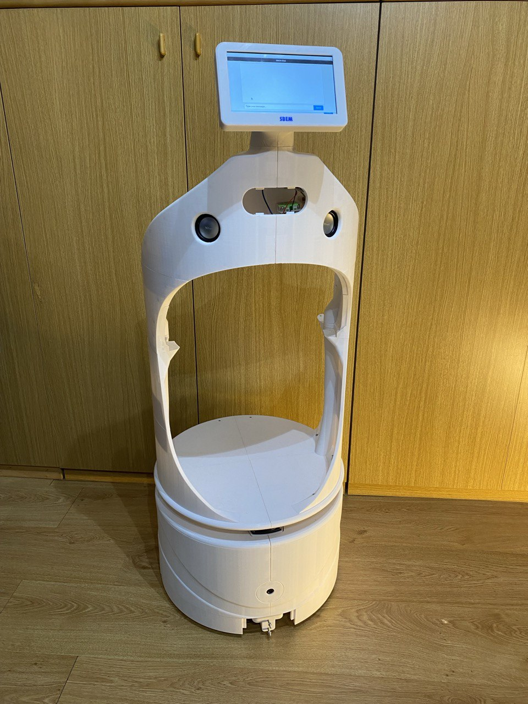
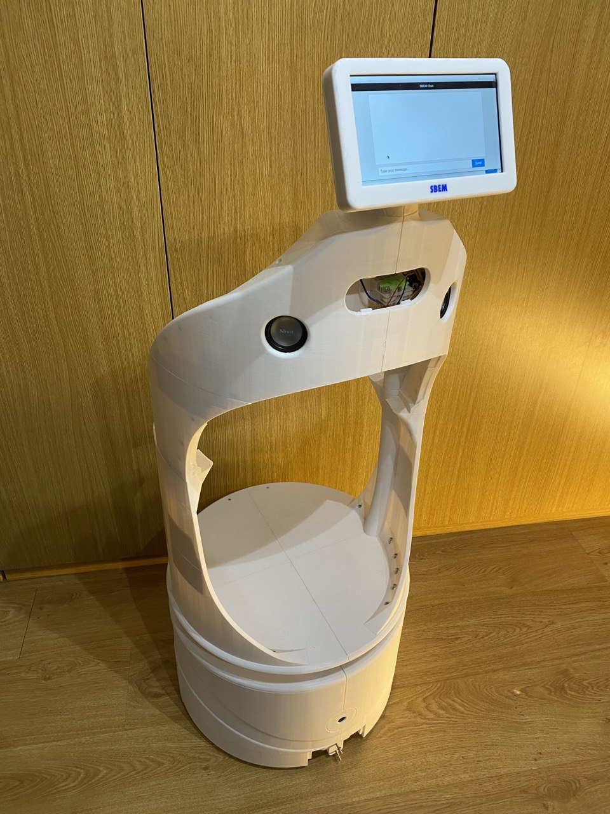
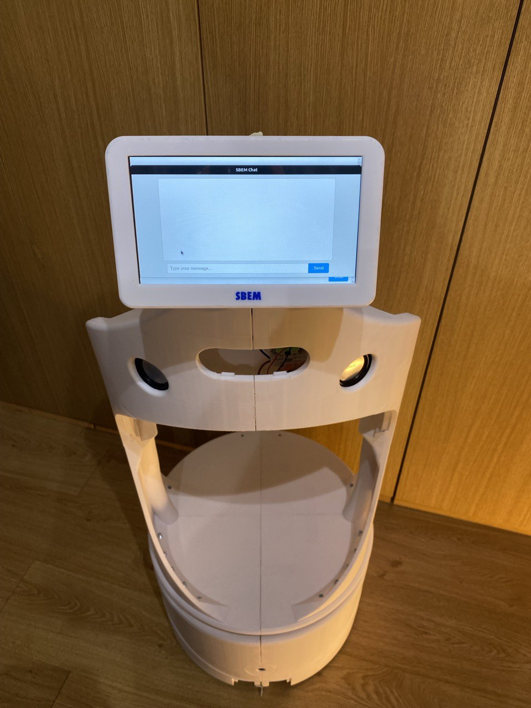
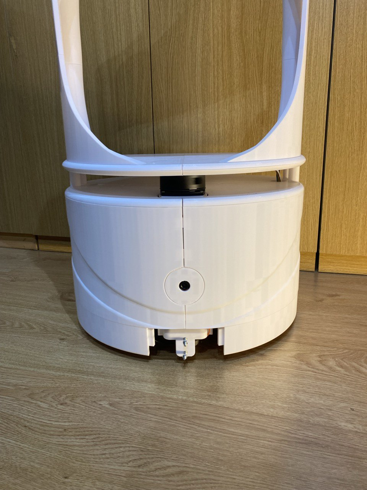

# Sbem - A Robotic Friend

This is my project, a robot built with ROS2 and completely 3D-printed. I created it to learn robotics and the ROS framework. I took inspiration from the **Really Useful Robot** by James Bruton, using his wheelbase but with modified motors and electronics. For ROS2, I followed the **Articulated Robotics** YouTube channel, which greatly helped me during my learning journey. I'm using also the ros2 package **audio_common** provided by **Miguel Ángel González Santamarta**. The chassis is completely designed by me and 3d printed.

The idea behind this robot is to use it for helping people in houses and use it as a friend with the power of LLM 

<div style="overflow-x: auto; white-space: nowrap;">
  
  
  
  
</div>

## Main Components
- **Two motors** from a hoverboard
- **Odrive 3.6** for motor control
- **Raspberry Pi 4** for communication with the server PC and ROS2 framework
- **ESP32 with MicroROS** for controlling Odrive via UART
- **Pi Camera** for docking system and AprilTag identification
- **Lidar A1** for navigation and Nav2 usage
- **LCD Screen** for GUI interface and simple debugging on Raspberry Pi
- **Microphone** for human-machine interaction *(TODO: Implement an array mic for spatial detection)*
- **(TODO) Intel RealSense D435i** for 3D perception

---

# Simple Navigation Guide
This section explains how to start all required packages for simple navigation using the **Nav2** stack in the real world or simulation.

### Steps to Start Navigation
1. Navigate to the project workspace:

   ```sh
   cd sbem_project_ws
   source install/setup.bash
   ```

2. Start essential nodes *(for real robot)*:

   ```sh
   ros2 launch robot_sbem sbem.launch.py  # Launch robot description
   ros2 run robot_sbem pub_odom_sbem.py  # Publish wheel odometry without transform
   ros2 run robot_sbem diff_tf.py # publish odom and transform --> use it when you don't use fuse imu 
   ros2 launch robot_sbem footprint_filter_laser.launch.py  # Filter robot shape in laser scan
   ros2 launch robot_sbem joystick.launch.py  # Enable joystick control if needed
   ros2 launch robot_sbem robot_localization.launch.py  # Fuse wheel odometry and IMU data (TODO)
   ```

    2.1 *(for simulated robot)*
      ```sh
      ros2 launch robot_sbem launch_sim.launch.py # start gazebo simulation, robot description and sensors
      ros2 launch robot_sbem footprint_filter_laser.launch.py  # Filter robot shape in laser scan
      ros2 launch robot_sbem joystick.launch.py  # Enable joystick control if needed
      ```

### Two Options After Initialization:
- **1 Create a new map**
- **2 Use a previously created custom map**

#### 1) Using SBEM with Mapping and Navigation:
```sh
ros2 launch robot_sbem online_async_launch.py params_file:=./config/mapper_params_online_async.yaml use_sim_time:=false
ros2 launch robot_sbem navigation_launch.py
```

#### 2) Using AMCL Localization (Set Initial Pose in RViz2):
```sh
ros2 launch robot_sbem localization_launch.py  # substitute with map that you want (ex: for gazebo ros2 launch robot_sbem localization_launch.py map:=src/robot_sbem/maps/new_virtual_map/new_map_save.yaml use_sim_time:=true)
ros2 launch robot_sbem navigation_launch.py map_subscribe_transient_local:=true # Prevent map updates # for gazebo use_sim_time:=true  
```

---

# Docking System
### Start Docking server by nav2 for Auto-Docking:
```sh
ros2 launch sbem_docking docking_sbem.launch.py # for real environment
ros2 launch sbem_docking docking_sbem.launch.py  params_file_dock:='/home/morolinux/Projects/Sbem/sbem_project_ws/src/sbem_docking/params/docking_simulation.yaml' use_sim_time:=true # for simulation

```

### Start Apriltag detection:
```sh
ros2 run apriltag_ros apriltag_node -ros-args -r image_rect:=/image_raw -r camera_info:=/camera_info --params-file `ros2 pkg prefix apriltag_ros`/share/apriltag_ros/cfg/tags_36h11.yaml
```

*(For Gazebo simulation, use:)*
```sh
ros2 run apriltag_ros apriltag_node -ros-args -r image_rect:=/camera/image_raw -r camera_info:=/camera/camera_info --params-file `ros2 pkg prefix apriltag_ros`/share/apriltag_ros/cfg/tags_36h11.yaml
```

### Command to send message to docking server: *(change coordinates)*
```sh
ros2 action send_goal /dock_robot opennav_docking_msgs/action/DockRobot "
{
  use_dock_id: false,
  dock_pose: {
    pose: {
      position: {x: 5.95, y: -1.85, z: 0.0},
      orientation: {x: -0.0, y: -0.0, z: 0.963, w: 0.268}
    },
    header: {
      frame_id: 'map'
    }
  },
  dock_type: 'nova_carter_dock',
  navigate_to_staging_pose: true
}"
```

### Command for Undocking: 
```sh
ros2 action send_goal /undock_robot opennav_docking_msgs/action/UndockRobot "{dock_type: 'nova_carter_dock'}"
```

---

# SBEM AI
A folder named **sbem_AI** contains all scripts required for interaction with SBEM's LLM-based system. The AI uses **LangChain** and **LangGraph** to create an agent that utilizes tools for controlling the robot's position using voice commands. I tried with last gemini model Gemini 2.0 Flash and local model qwen2.5:14b with ollama

### Procedure:
1. **Start a TTS server** using Piper or CoquiTTS for now.
2. **Run the AI agent:**
   ```sh
   python3 agent_sbem.py
   ```


---

# Starting SBEM Nodes on Raspberry Pi
To run the real SBEM robot, start the following nodes on the Raspberry Pi:
```sh
cd Desktop/sbem_ws/
source install/setup.bash
```

### Essential ROS2 Nodes:
```sh
ros2 run micro_ros_agent micro_ros_agent serial --dev /dev/ttyACM0  # MicroROS communication with ESP32

Desktop/sbem_ws/src/robot_sbem/scripts$ python3 imu_publisher.py # Publish imu data with raspberry

ros2 run rplidar_ros rplidar_composition --ros-args -p serial_port:=/dev/ttyUSB0 -p frame_id:=laser_frame -p angle_compensate:=true -p scan_mode:=Standard -p serial_baudrate:=115200  # Start Lidar

ros2 run v4l2_camera v4l2_camera_node --ros-args -p image_size:="[640,480]" -p camera_frame_id:=camera_link_optical  # Start camera feed
```
### Scripts for microphone and play sound in raspberry
In order to enable microphone and speakers of sbem is required to start 2 scripts in raspberry environment:
```sh
ros2 run audio_common audio_capturer_node
python3 tts_sbem.py
```

### SBEM App
There is simple gui interface that can be used in order to chat with sbem llm system. The app is written in javascript and it use electron framework, 
to provide communication between ROS2 and javascript world I use rosbridge and roslib library. Start rosbridge server:
```sh
ros2 launch rosbridge_server rosbridge_websocket_launch.xml
```


