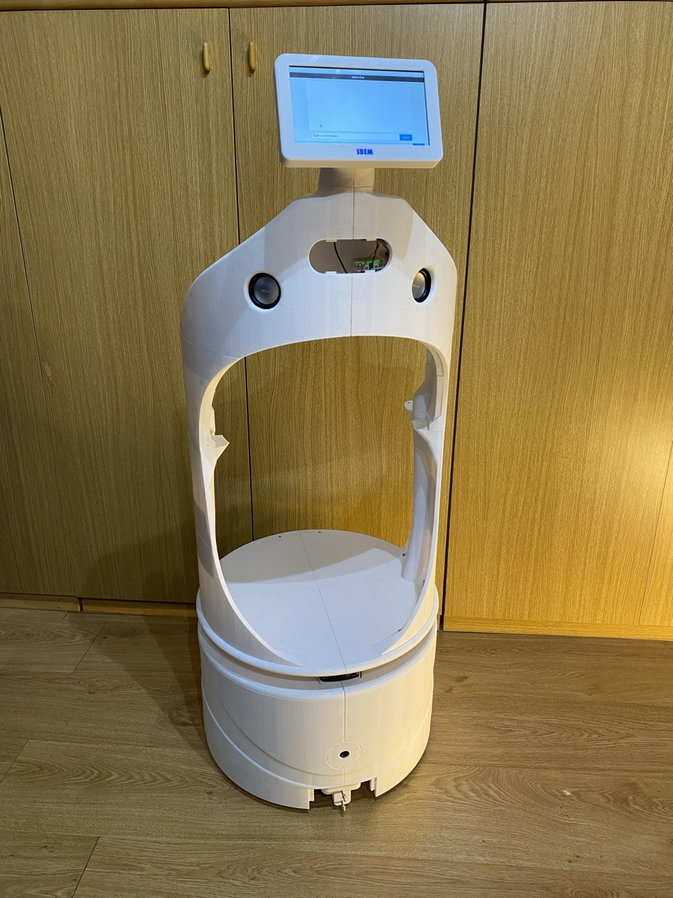
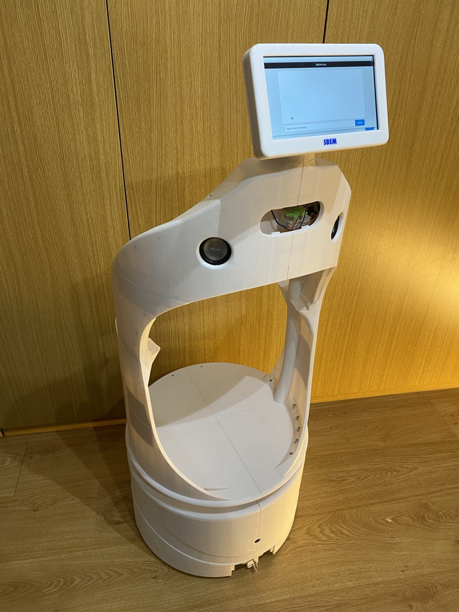
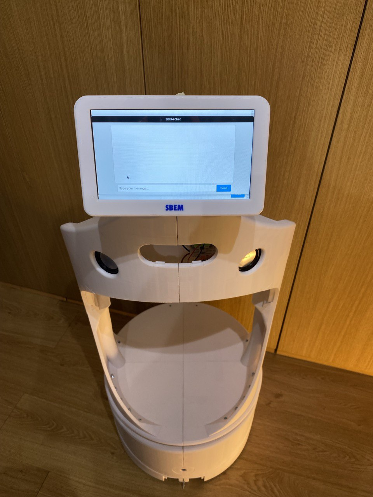
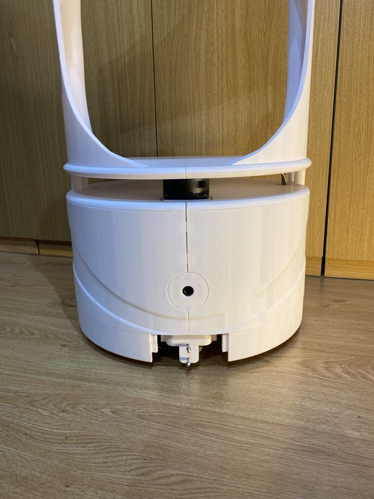

# Sbem - A Robotic Friend

This is my project, a robot built with ROS2 and completely 3D-printed. I created it to learn robotics and the ROS framework. I took inspiration from the **Really Useful Robot** by James Bruton, using his wheelbase but with modified motors and electronics. For ROS2, I followed the **Articulated Robotics** YouTube channel, which greatly helped me during my learning journey. The chassis is completely designed by me and 3d printed.

The idea behind this robot is to use it for helping people in houses and use it as a friend with the power of LLM 

<div style="overflow-x: auto; white-space: nowrap;">
  
  
  
  
</div>

## Main Components
- **Two motors** from a hoverboard
- **Odrive 3.6** for motor control
- **Jetson Orin nano** for communication with the server PC and ROS2 framework
- **ESP32** for controlling Odrive via UART
- **Pi Camera** for docking system and AprilTag identification
- **Lidar A1** for navigation and Nav2 usage
- **LCD Screen** for GUI interface and simple debugging on Raspberry Pi
- **Microphone** for human-machine interaction *(TODO: Implement an array mic for spatial detection)*
- **(TODO) Intel RealSense D415** for 3D perception

---


# Simple Guide to Start the Robot
The entire system runs inside an Isaac ROS container, which is built using the `isaac_ros_common` package. A pre-built image is available in the package, but I include the [Dockerfile](./docker/Dockerfile.sbem) to install all dependencies required for the robot.

### Permission to Access USB Devices
To allow the container to access USB devices (like the Odrive and ESP32), you need to set up udev rules on your host machine. This will enable the container to communicate with the hardware components without running into permission issues.

## Steps to Start the Robot
1. Navigate to the project workspace:

   ```sh
   cd sbem_project_ws
   source install/setup.bash
   ```

2. Start essential nodes
    ```sh
    ros2 launch robot_sbem sbem_periphericals.launch.py # launch lidar node (and laser filter), ros2_control communication with esp32, imu node

    ros2 launch robot_sbem sbem_loc_nav_dock.launch.py # launch localization, nav2 and docking server
    ```
3. If you want to use 3D perception for mapping and collision avoidance, you can start the nvblox server:
    ```sh
    ros2 launch sbem_nvblox_bringup sbem_realsense_nvblox.launch.py # launched inside a container
    ```

## Apriltag detection for Auto-Docking
This section explains how to start the apriltag detection node and send messages to the docking server for auto-docking. The docking system is based on AprilTag detection, which provides the robot with the relative pose of the dock. The docking server then uses this information to navigate and align the robot with the dock for charging.

### Start Apriltag detection:
    ```sh
    ros2 launch sbem_docking apriltag_detection_realsense.launch.py # launched inside a container created by sbem_nvblox_bringup package
    ```

### Command to send message to docking server:
    ```sh
    ros2 action send_goal /dock_robot opennav_docking_msgs/action/DockRobot "
    {
      use_dock_id: True,
      dock_id: 'home_dock',
      dock_type: 'nova_carter_dock',
      navigate_to_staging_pose: true
    }"
    ```

### Command for Undocking: 
    ```sh
    ros2 action send_goal /undock_robot opennav_docking_msgs/action/UndockRobot "{dock_type: 'nova_carter_dock'}"
    ```

